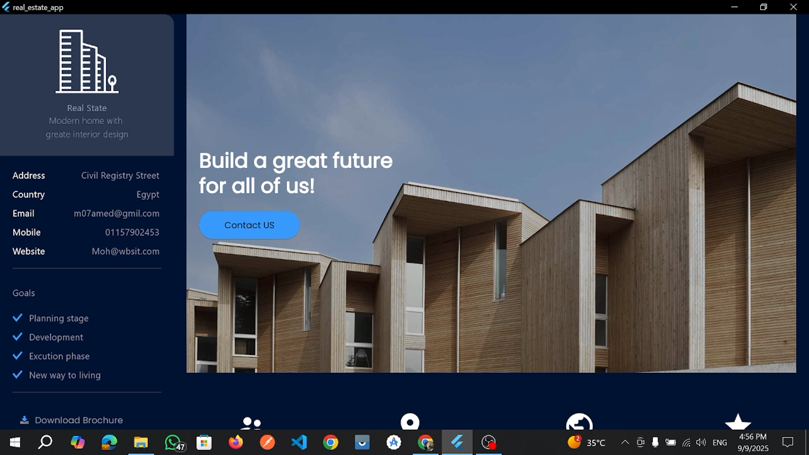
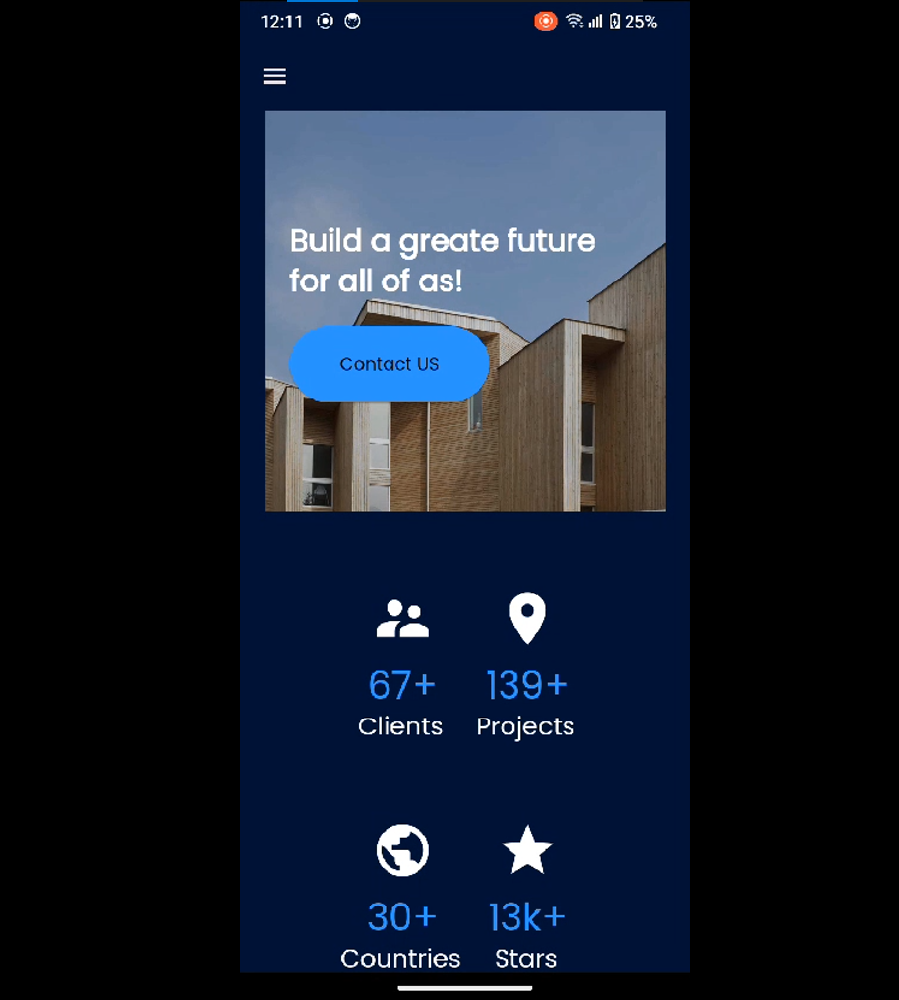
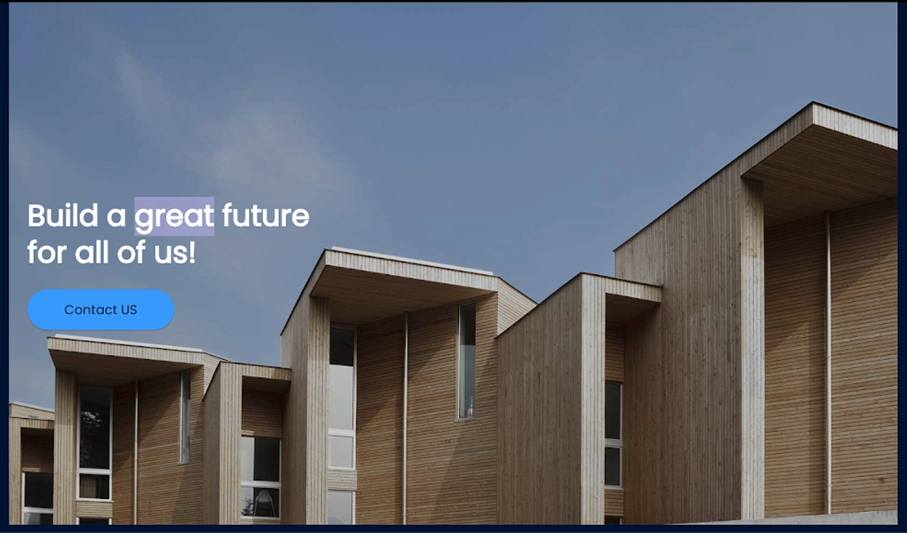
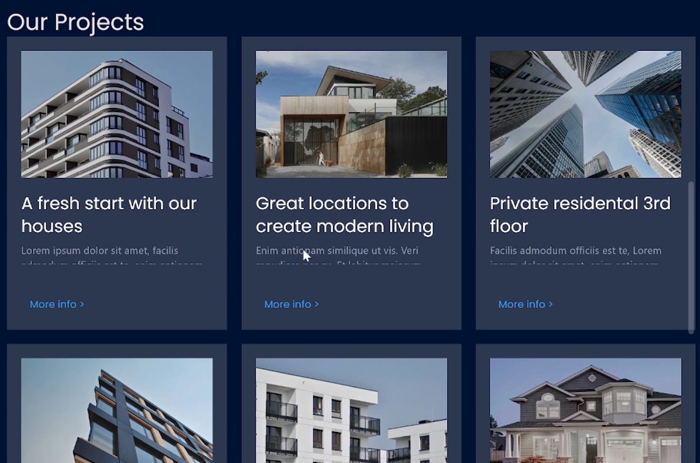
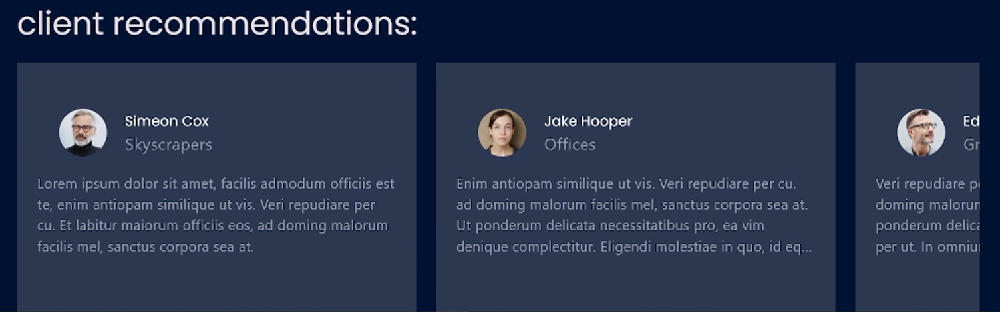
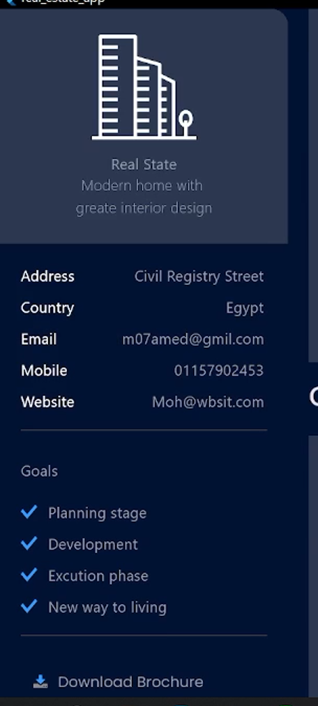

# 🏠 Real Estate UI – Reference Project  

  
  
  

---

⚠️ **Note**: This repository is a reference/mock of an old real estate project.  
The new client project **“Student Housing App”** is being developed separately and is available [here](#).  

This project contains **UI code, demo data, and assets** used in a previous real estate website/app.  
It serves as a **visual reference and inspiration** for the new project.  

---

## 🎬 Demo Videos  

- **Web (Laptop)**  
  [](assets/videos/web-demo.mp4)  

- **Android App**  
  [](assets/videos/android-demo.mp4)  

📂 Videos are stored in the `videos/` folder for reference purposes.  

---

## 📦 Project Structure  


lib/                   # Flutter UI code
assets/
  images/              # Screenshots, project images, logos
  icons/               # SVG icons used in the UI
  screenshots/         # Screenshots of the app for README
videos/                # Demo recordings

---

## 📝 Demo Data  

**Projects**  
`Project(title, image, description)`  

**Recommendations**  
`Recommendation(name, image, source, text)`  

These data entries are **mock only** and do not connect to any backend.  

---


## ⚡ Features Included  

- Responsive layout for desktop, tablet, and mobile devices  
- Dark & Light mode themes implemented with Google Fonts  
- Sidebar menu with logo, contact info, goals, and social links  
- Projects & Recommendations widgets for showcasing content  
- Custom icons and reusable widgets (`CustomIconButton`, `buildGoals`, `buildContactInfo`)  

---
## 📌 Screenshots (Grid) 

<div style="display: flex; flex-wrap: wrap; gap: 10px;">     </div>

---

## 💡 Notes  

- This repository is **archival and for reference only**  
- All new development, including **Student Housing App** features, is in the new repository  
- UI and assets here can be reused or adapted for the new project  
- No backend integration is included in this version  

---

## ✅ Usage  

- Use as a **reference** for layouts, widgets, and design elements  
- Helpful for **rapid prototyping** in Flutter projects  
- Includes **assets and demo data** to speed up UI mockups  

---

## 📖 How to Run  

1. **Clone the repository**  
```bash
   git clone https://github.com/your-username/real-estate-ui.git
   cd real-estate-ui
```

2. **Install dependencies**  

```bash
flutter pub get
```

3. **Run the project**  

On Android Emulator / Device:

```bash
flutter run
```

On Web (Chrome):

```bash
flutter run -d chrome
```

---

## ☕ Support the Project

If you find **Flutter Gradle Doctor** useful and want to support its development, you can buy me a coffee:

[](https://www.buymeacoffee.com/Mohamed_Fawzy)


